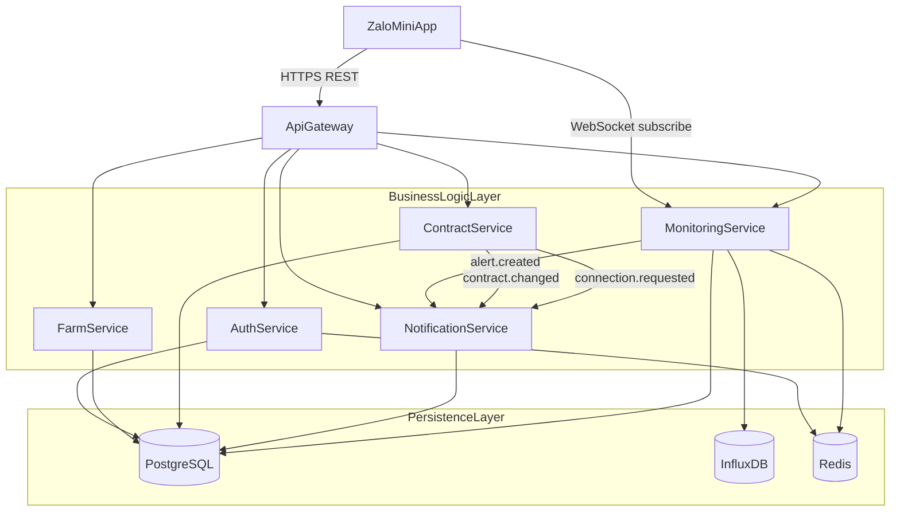

# Tài liệu thiết kế — Đặc tả API Backend (NestJS, bốn tầng, năm microservice cốt lõi)

## Tổng quan

Tài liệu này là **source of truth** về hợp đồng API backend của TrustAgri Zalo Mini App. Kiến trúc đã chốt:

- **Layered Architecture**: Presentation (Zalo Mini App) → Gateway (API Gateway) → Business Logic (Microservices) → Persistence (PostgreSQL + InfluxDB + Redis).
- **Business Logic Layer** giới hạn trong **năm microservice cốt lõi**:
  1. **Auth Service** (Core) — xác thực và hồ sơ người dùng (`farmer` / `trader` / `buyer`).
  2. **Notification Service** (Core) — thông báo và xuất bản tin tức/dự báo (`news` / `forecast`).
  3. **Farm Service** (Business Domain) — hồ sơ vườn, nhật ký chăm sóc, minh chứng, thư viện tiêu chuẩn, truy xuất nguồn gốc QR.
  4. **Contract Service** (Business Domain) — sản phẩm, nhu cầu mua, đơn hàng, đề xuất, hợp đồng, yêu cầu thay đổi, kết nối, tuân thủ, tổng hợp dashboard.
  5. **Monitoring Service** (Monitoring Domain) — cảm biến latest/history, cảnh báo ngưỡng, đẩy thời gian thực.
- **Framework**: NestJS + TypeScript, Clean Architecture, module-based (một module NestJS = một bounded context của service).

Toàn bộ FR trong đề tài (mục 4.3.2) được **phân bổ lại** cho năm service trên.

## 1. Quy ước đặt tên JSON và lỗi (bắt buộc)

### 1.1 Quy ước đặt tên

- **Request body**, **query params**, **response body**: mọi trường SHALL dùng **camelCase**.
- Ví dụ chuẩn:
  - `farmId`, `userId`, `cropType`, `isImputed`, `createdAt`, `acknowledgedAt`, `readAt`, `lastLogin`, `requestId`.
- Cột cơ sở dữ liệu **có thể** dùng `snake_case` nhưng **phải map sang camelCase** trước khi serialize ra JSON.

### 1.2 Hợp đồng lỗi chuẩn (áp dụng mọi endpoint)

```typescript
interface ErrorResponse {
  error: {
    code: string;          // mã lỗi chuẩn
    message: string;       // nội dung tiếng Việt thân thiện
    details?: unknown;     // validate theo trường hoặc ngữ cảnh
    timestamp: string;     // ISO-8601
    requestId: string;     // correlation id
  };
}
```

| HTTP | code | Khi nào dùng |
|---|---|---|
| 400 | `INVALID_INPUT` | Validate thất bại (`class-validator`) |
| 401 | `UNAUTHORIZED` | Thiếu hoặc hết hạn token |
| 403 | `FORBIDDEN` | Không đủ quyền theo role |
| 404 | `NOT_FOUND` | Resource không tồn tại |
| 409 | `CONFLICT` | Xung đột trạng thái (ví dụ đồng bộ, state machine) |
| 429 | `RATE_LIMIT_EXCEEDED` | Vượt ngưỡng rate limit |
| 500 | `INTERNAL_ERROR` | Lỗi không xác định |
| 503 | `SERVICE_UNAVAILABLE` | Lỗi dependency downstream |

### 1.3 Phản hồi danh sách (không bọc envelope)

- Phản hồi thành công **không** dùng envelope — trả trực tiếp entity hoặc `{ items, page, limit, total }` với danh sách.
- Chuẩn danh sách:

```typescript
interface ListResponse<T> {
  items: T[];
  page: number;
  limit: number;
  total: number;
}
```

## 2. Sơ đồ kiến trúc



## 3. Luồng dữ liệu

### 3.1 Luồng giao dịch (Transactional Flow)

Zalo Mini App → API Gateway → Auth / Farm / Contract → PostgreSQL (+ Redis cache).

### 3.2 Luồng giám sát (Monitoring Flow)

Thu thập cảm biến → Monitoring Service → InfluxDB + Redis (latest state) → (vượt ngưỡng) → sự kiện `alert.created` → Notification Service → đẩy Zalo + danh sách thông báo trong app.

### 3.3 Luồng thời gian thực (Realtime Flow)

Client đăng ký WebSocket `subscribe_farm` → Monitoring Service xác thực role → push sự kiện `sensor_update`.

## 4. Thiết kế service và hợp đồng API (REST)

Mỗi nhóm endpoint đều ghi rõ **ánh xạ FR** để đảm bảo không thừa / không thiếu.

### 4.1 Auth Service (module NestJS: `auth`, `users`)

Phân bổ FR: FR-S01, FR-T01, phần profile cho farmer/buyer.

| Endpoint | FR | Request body (camelCase) | Response body |
|---|---|---|---|
| `POST /api/v1/auth/login` | FR-S01 | `{ zaloAccessToken }` | `{ accessToken, refreshToken, userId, role, expiresAt }` |
| `POST /api/v1/auth/verify` | FR-S01 | `{}` (header token) | `{ userId, role, valid: true }` |
| `POST /api/v1/auth/logout` | FR-S01 | `{}` | `{ success: true }` |
| `GET /api/v1/auth/me` | FR-S01, FR-T01 | - | `UserProfileDto` |
| `PUT /api/v1/auth/me` | FR-T01, FR-F01, FR-U* | `UserProfileUpdateDto` | `UserProfileDto` |

**UserProfileDto** (thống nhất cho mọi role):

```typescript
interface UserProfileDto {
  userId: string;
  zaloId: string;
  role: 'farmer' | 'trader' | 'buyer' | 'guest';
  displayName: string;
  phone?: string;
  email?: string;
  avatarUrl?: string;
  traderProfile?: {
    companyName: string;
    region: string;
    capacity: string;
    trustScore: number;
  };
  farmerProfile?: {
    region: string;
    experienceYears: number;
  };
  buyerProfile?: {
    organizationName?: string;
  };
  createdAt: string;
  lastLogin: string;
}
```

### 4.2 Notification Service (NestJS module: `notifications`, `news`, `forecasts`)

Phân bổ FR: FR-F08 (delivery), FR-T12, FR-G02.

| Endpoint | FR | Req | Res |
|---|---|---|---|
| `GET /api/v1/notifications` | dùng chung | `?page&limit&unreadOnly` | `ListResponse<NotificationDto>` |
| `POST /api/v1/notifications/:id/read` | dùng chung | `{}` | `{ success: true }` |
| `POST /api/v1/notifications/read-all` | dùng chung | `{}` | `{ updated: number }` |
| `GET /api/v1/news` | FR-T12, FR-G02 | `?page&limit&category` | `ListResponse<NewsArticleDto>` |
| `GET /api/v1/news/:id` | FR-T12, FR-G02 | - | `NewsArticleDto` |
| `POST /api/v1/news` (trader) | FR-T12 | `NewsArticleCreateDto` | `NewsArticleDto` |
| `PUT /api/v1/news/:id` (trader) | FR-T12 | `NewsArticleUpdateDto` | `NewsArticleDto` |
| `GET /api/v1/forecasts` | FR-G02 | `?region&type` | `ListResponse<ForecastDto>` |
| `POST /api/v1/forecasts` (trader) | FR-T12 | `ForecastCreateDto` | `ForecastDto` |

**NotificationDto**:

```typescript
interface NotificationDto {
  id: string;
  type: 'alert' | 'contract' | 'connection' | 'system';
  title: string;
  body: string;
  severity?: 'info' | 'warning' | 'danger';
  linkTo?: string;        // deep link trong Mini App
  read: boolean;
  readAt?: string;
  createdAt: string;
}
```

### 4.3 Farm Service (NestJS module: `farms`, `care-logs`, `standards`, `traceability`)

Phân bổ FR: FR-F01, FR-F05, FR-F06, FR-F09, FR-T07, FR-T10, FR-G01.

| Endpoint | FR | Mô tả ngắn |
|---|---|---|
| `POST /api/v1/farms` | FR-F01 | Tạo Farm Lab (nông dân) |
| `GET /api/v1/farms` | FR-F01, FR-T07 | Danh sách + lọc `?region&cropType&ownerId&page&limit` |
| `GET /api/v1/farms/:id` | FR-F01 | Chi tiết vườn |
| `PUT /api/v1/farms/:id` | FR-F01 | Cập nhật vườn (chỉ chủ sở hữu) |
| `DELETE /api/v1/farms/:id` | FR-F01 | Xóa (nếu không có hợp đồng `active`) |
| `GET /api/v1/farms/:id/care-logs` | FR-F09 | Danh sách care log có phân trang |
| `POST /api/v1/farms/:id/care-logs` | FR-F09 | Tạo một care log |
| `POST /api/v1/farms/:id/care-logs/sync` | FR-F09 (offline) | Đồng bộ batch hàng đợi offline |
| `POST /api/v1/farms/:id/evidence` | FR-F09 | Metadata minh chứng (URL file do FE upload trước, BE lưu metadata) |
| `GET /api/v1/standards` | FR-T10, FR-F06 | Danh sách tiêu chuẩn (VietGAP / GlobalGAP / Hữu cơ) |
| `GET /api/v1/standards/:id` | FR-T10, FR-F06 | Chi tiết tiêu chuẩn + bước |
| `POST /api/v1/standards` (trader) | FR-T10 | Tạo tiêu chuẩn mới |
| `PUT /api/v1/standards/:id` (trader) | FR-T10 | Cập nhật tiêu chuẩn |
| `DELETE /api/v1/standards/:id` (trader) | FR-T10 | Xóa tiêu chuẩn |
| `GET /api/v1/traceability/qr/:code` | FR-G01 | **Public, không auth**, trả về `TraceabilityDto` |

**FarmDto**:

```typescript
interface FarmDto {
  id: string;
  ownerId: string;          // userId nông dân
  name: string;             // ví dụ: "Farm Lab Đông A"
  location: { province: string; district: string; addressLine: string; lat?: number; lng?: number };
  area: number;             // m²
  cropType: string;         // ví dụ: "dragon_fruit"
  standardId?: string;      // liên kết tiêu chuẩn (FR-F06)
  createdAt: string;
  updatedAt: string;
}
```

**CareLogDto**:

```typescript
interface CareLogDto {
  id: string;
  farmId: string;
  standardStepId?: string;  // bước trong quy trình chuẩn (tuân thủ FR-F06)
  action: string;           // "watering" | "fertilizing" | ...
  notes?: string;
  performedAt: string;
  evidences: EvidenceDto[];
  deviation?: boolean;      // lệch quy trình (FR-T11)
  syncStatus: 'synced' | 'pending' | 'conflict';
  clientRecordId?: string;  // idempotency cho đồng bộ offline
}

interface EvidenceDto {
  id: string;
  careLogId: string;
  fileUrl: string;
  mimeType: string;
  capturedAt: string;
}
```

**StandardDto**:

```typescript
interface StandardDto {
  id: string;
  code: string;             // "VIETGAP_2024"
  name: string;
  description: string;
  ownerTraderId?: string;   // null = tiêu chuẩn chung hệ thống
  steps: StandardStepDto[];
  createdAt: string;
}

interface StandardStepDto {
  id: string;
  order: number;
  title: string;
  description: string;
  expectedDurationDays?: number;
  acceptanceCriteria?: string;
}
```

**TraceabilityDto** (public, chỉ đọc):

```typescript
interface TraceabilityDto {
  productCode: string;
  farm: Pick<FarmDto, 'id' | 'name' | 'location' | 'cropType'>;
  standard?: Pick<StandardDto, 'code' | 'name'>;
  careLogTimeline: Array<Pick<CareLogDto, 'action' | 'performedAt' | 'notes'>>;
  sensorChart: Array<{ sensorType: string; series: Array<{ t: string; value: number }> }>;
}
```

**Phản hồi đồng bộ**:

```typescript
interface CareLogSyncResponse {
  results: Array<{
    clientRecordId: string;
    status: 'accepted' | 'conflicted' | 'rejected';
    serverId?: string;
    reason?: string;
  }>;
}
```

### 4.4 Contract Service (NestJS module: `products`, `buying-requests`, `orders`, `proposals`, `contracts`, `connections`, `dashboard`)

Phân bổ FR: FR-F02, FR-F03, FR-F04, FR-F05, FR-T02, FR-T03, FR-T04, FR-T05, FR-T06, FR-T07, FR-T08, FR-T09, FR-T11, FR-U01, FR-U02, FR-U03, FR-U04, FR-U06, FR-G03.

#### 4.4.1 Sản phẩm / Marketplace (FR-T03, FR-U01, FR-G03)

| Endpoint | FR | Ghi chú |
|---|---|---|
| `GET /api/v1/products` | FR-U01, FR-G03 | Danh sách public, lọc `?cropType&region&priceMin&priceMax&traderId&page&limit` |
| `GET /api/v1/products/:id` | FR-U01, FR-G03 | Chi tiết public, kèm tham chiếu vườn |
| `POST /api/v1/products` (trader) | FR-T03 | Tạo mặt hàng |
| `PUT /api/v1/products/:id` (trader) | FR-T03 | Cập nhật |
| `DELETE /api/v1/products/:id` (trader) | FR-T03 | Tắt / xóa |

**ProductDto**:

```typescript
interface ProductDto {
  id: string;
  traderId: string;
  farmId?: string;
  name: string;
  cropType: string;
  unit: string;             // "kg"
  price: number;
  currency: 'VND';
  images: string[];
  standardCode?: string;
  stockQuantity?: number;
  description?: string;
  status: 'active' | 'inactive';
  createdAt: string;
}
```

#### 4.4.2 Buying Requests (FR-U02, FR-T04)

| Endpoint | FR |
|---|---|
| `GET /api/v1/buying-requests` | FR-T04, FR-U02 (danh sách của tôi) |
| `GET /api/v1/buying-requests/:id` | Chi tiết |
| `POST /api/v1/buying-requests` (buyer) | FR-U02 |
| `PUT /api/v1/buying-requests/:id` (buyer owner) | Cập nhật |
| `DELETE /api/v1/buying-requests/:id` (buyer owner) | Hủy |

**BuyingRequestDto**:

```typescript
interface BuyingRequestDto {
  id: string;
  buyerId: string;
  cropType: string;
  quantity: number;
  unit: string;
  qualityStandardCode?: string;
  expectedPrice?: number;
  depositOffered?: number;
  deliveryDate: string;
  status: 'open' | 'matched' | 'closed';
  createdAt: string;
}
```

#### 4.4.3 Orders (FR-U01, FR-T05, FR-U06)

| Endpoint | FR |
|---|---|
| `GET /api/v1/orders` | FR-U06, FR-T05 (lọc `?status&role&from&to&page&limit`) |
| `GET /api/v1/orders/:id` | Chi tiết |
| `POST /api/v1/orders` (buyer) | FR-U01 (đặt mua trực tiếp) |
| `POST /api/v1/orders/:id/accept` (trader) | FR-T05 |
| `POST /api/v1/orders/:id/reject` (trader) | FR-T05 |
| `POST /api/v1/orders/:id/cancel` (buyer) | FR-U04 — hủy trước khi xác nhận |

**OrderDto**:

```typescript
interface OrderDto {
  id: string;
  buyerId: string;
  traderId: string;
  productId: string;
  quantity: number;
  unit: string;
  totalPrice: number;
  deposit?: number;
  status: 'pending' | 'accepted' | 'rejected' | 'cancelled' | 'contracted' | 'completed';
  createdAt: string;
  updatedAt: string;
}
```

#### 4.4.4 Proposals (FR-U03, FR-T04)

| Endpoint | FR |
|---|---|
| `GET /api/v1/proposals` | FR-U03, FR-T04 (filter `?buyingRequestId&status`) |
| `POST /api/v1/proposals` (trader) | FR-T04 (phản hồi buying request) |
| `POST /api/v1/proposals/:id/accept` (buyer) | FR-U03 → tạo hợp đồng |
| `POST /api/v1/proposals/:id/reject` (buyer) | FR-U03 |

**ProposalDto**:

```typescript
interface ProposalDto {
  id: string;
  buyingRequestId: string;
  traderId: string;
  price: number;
  quantity: number;
  standardCode?: string;
  note?: string;
  status: 'pending' | 'accepted' | 'rejected';
  createdAt: string;
}
```

#### 4.4.5 Contracts & Change Requests (FR-F04, FR-F05, FR-T06, FR-T09, FR-U04)

| Endpoint | FR |
|---|---|
| `GET /api/v1/contracts` | FR-F04, FR-U06 (filter `?role&status&page&limit`) |
| `GET /api/v1/contracts/:id` | Chi tiết |
| `POST /api/v1/contracts` | FR-T06/T09 (tạo thủ công khi không qua luồng order) |
| `GET /api/v1/contracts/:id/change-requests` | FR-F05, FR-T06, FR-T09, FR-U04 |
| `POST /api/v1/contracts/:id/change-requests` | Bất kỳ bên nào |
| `POST /api/v1/contracts/:id/change-requests/:changeId/accept` | Bên còn lại |
| `POST /api/v1/contracts/:id/change-requests/:changeId/reject` | Bên còn lại |
| `GET /api/v1/contracts/:id/compliance` | FR-T11 |

**ContractDto**:

```typescript
interface ContractDto {
  id: string;
  partyFarmerId?: string;
  partyTraderId: string;
  partyBuyerId?: string;
  contractType: 'farmer_trader' | 'trader_buyer';
  productId?: string;
  standardId?: string;
  farmId?: string;
  quantity: number;
  unit: string;
  totalPrice: number;
  deposit?: number;
  startDate: string;
  endDate: string;
  status: 'active' | 'pending_change' | 'completed' | 'cancelled';
  terms: string;
  createdAt: string;
}

interface ContractChangeRequestDto {
  id: string;
  contractId: string;
  requestedBy: string;       // userId
  changes: Record<string, { oldValue: unknown; newValue: unknown }>;
  reason?: string;
  status: 'pending' | 'accepted' | 'rejected';
  respondedBy?: string;
  createdAt: string;
  respondedAt?: string;
}

interface ComplianceDto {
  contractId: string;
  standardCode: string;
  totalSteps: number;
  completedSteps: number;
  deviations: Array<{ careLogId: string; stepId: string; reason: string; detectedAt: string }>;
  complianceScore: number;   // 0..1
  lastComputedAt: string;
}
```

#### 4.4.6 Connections (FR-F02, FR-F03, FR-T07, FR-T08)

| Endpoint | FR |
|---|---|
| `GET /api/v1/traders/search` | FR-F02 (nông dân tìm thương lái) |
| `GET /api/v1/farmers/search` | FR-T07 (thương lái tìm nguồn cung) |
| `GET /api/v1/connections` | FR-F03, FR-T08 (lọc `?role=incoming/outgoing&status`) |
| `POST /api/v1/connections` | FR-F02, FR-T07 (gửi yêu cầu) |
| `POST /api/v1/connections/:id/accept` | FR-F03, FR-T08 |
| `POST /api/v1/connections/:id/reject` | FR-F03, FR-T08 |

**ConnectionDto**:

```typescript
interface ConnectionDto {
  id: string;
  fromUserId: string;
  toUserId: string;
  fromRole: 'farmer' | 'trader';
  toRole: 'farmer' | 'trader';
  farmId?: string;
  message?: string;
  status: 'pending' | 'accepted' | 'rejected';
  createdAt: string;
  respondedAt?: string;
}
```

#### 4.4.7 Dashboard Aggregation (FR-T02)

| Endpoint | FR | Mô tả |
|---|---|---|
| `GET /api/v1/dashboard/trader` | FR-T02 | Xu hướng nhu cầu, khối lượng order, hợp đồng active, cây trồng hàng đầu |
| `GET /api/v1/dashboard/farmer` | Tóm tắt cho nông dân | KPI vườn (tuân thủ chăm sóc, cảnh báo gần đây) |
| `GET /api/v1/dashboard/buyer` | Tóm tắt cho người mua | Yêu cầu mở, đề xuất đang chờ |

**DashboardTraderDto** (ví dụ):

```typescript
interface DashboardTraderDto {
  periodFrom: string;
  periodTo: string;
  orderCountByStatus: Record<string, number>;
  demandTrend: Array<{ date: string; requestCount: number }>;
  topCrops: Array<{ cropType: string; volume: number }>;
  activeContracts: number;
  pendingConnections: number;
}
```

### 4.5 Monitoring Service (NestJS module: `sensors`, `alerts`)

Phân bổ FR: FR-F07, FR-F08, FR-T11 (phần dữ liệu), FR-U05.

| Endpoint | FR | Mô tả |
|---|---|---|
| `GET /api/v1/monitoring/farms/:farmId/latest` | FR-F07, FR-U05 | Snapshot mới nhất từ Redis |
| `GET /api/v1/monitoring/farms/:farmId/history` | FR-F07, FR-T11 | `?from&to&interval&sensorType` |
| `GET /api/v1/monitoring/farms/:farmId/alerts` | FR-F08 | `?status&severity&page&limit` |
| `POST /api/v1/monitoring/alerts/:id/acknowledge` | FR-F08 | Xác nhận đã xem cảnh báo |
| `WS /ws/monitoring` (subscribe `subscribe_farm`) | FR-F07 | Đẩy thời gian thực |

**SensorReadingDto**:

```typescript
interface SensorReadingDto {
  farmId: string;
  sensorType: 'temperature' | 'humidity' | 'light' | 'soil_moisture';
  value: number;
  unit: string;
  isImputed: boolean;
  recordedAt: string;
}
```

**AlertDto**:

```typescript
interface AlertDto {
  id: string;
  farmId: string;
  sensorType: string;
  severity: 'warning' | 'danger';
  threshold: number;
  value: number;
  suggestedAction?: string;
  acknowledged: boolean;
  acknowledgedBy?: string;
  acknowledgedAt?: string;
  createdAt: string;
}
```

## 5. Mô hình persistence

### 5.1 PostgreSQL (thực thể giao dịch)

`users`, `farms`, `care_logs`, `evidences`, `standards`, `standard_steps`, `products`, `buying_requests`, `orders`, `proposals`, `contracts`, `contract_change_requests`, `connections`, `alerts`, `notifications`, `news_articles`, `forecasts`.

### 5.2 InfluxDB (chuỗi thời gian)

- measurement: `sensor_reading`
- tags: `farmId`, `sensorType`, `isImputed`
- fields: `value`

### 5.3 Redis

- `session:{token}` → phiên người dùng
- `farm:{farmId}:sensor:{sensorType}` → cache đọc mới nhất
- `dashboard:trader:{userId}` → cache dashboard TTL ngắn

## 6. Bảo mật và độ tin cậy

- HTTPS/TLS bắt buộc tại Gateway.
- JWT bearer token từ Auth Service; `role` claim + thời hạn.
- Role-based guards (decorator NestJS `@Roles`).
- Rate limit tại Gateway (token bucket).
- Circuit breaker tại Gateway khi service downstream lỗi.
- Audit log cho thao tác ghi (care log, thay đổi hợp đồng, kết nối).

## 7. Ma trận traceability FR → Service → Endpoint

| FR | Module | Endpoint(s) |
|---|---|---|
| FR-S01 | Auth | `/auth/login`, `/auth/verify`, `/auth/logout`, `/auth/me` |
| FR-F01 | Farm | `/farms` CRUD |
| FR-F02 | Contract | `/traders/search`, `POST /connections` |
| FR-F03 | Contract | `GET /connections`, `/connections/:id/accept|reject` |
| FR-F04 | Contract | `GET /contracts`, `GET /contracts/:id` |
| FR-F05 | Contract | `/contracts/:id/change-requests*` |
| FR-F06 | Farm | `/standards`, `/standards/:id` |
| FR-F07 | Monitoring | `/monitoring/farms/:farmId/latest|history`, WS |
| FR-F08 | Monitoring + Notification | `/monitoring/.../alerts`, acknowledge, + `/notifications` |
| FR-F09 | Farm | `/farms/:id/care-logs`, `.../sync`, `.../evidence` |
| FR-T01 | Auth | `/auth/me` (PUT) + traderProfile |
| FR-T02 | Contract | `/dashboard/trader` |
| FR-T03 | Contract | `/products` CRUD |
| FR-T04 | Contract | `GET /buying-requests`, `POST /proposals` |
| FR-T05 | Contract | `GET /orders`, `/orders/:id/accept|reject` |
| FR-T06 | Contract | `/contracts/:id/change-requests*` (với buyer) |
| FR-T07 | Contract + Farm | `/farmers/search`, `/farms?ownerId`, `POST /connections` |
| FR-T08 | Contract | `GET /connections?role=incoming`, accept/reject |
| FR-T09 | Contract | `/contracts/:id/change-requests*` (với nông dân) |
| FR-T10 | Farm | `/standards` CRUD |
| FR-T11 | Contract + Monitoring | `/contracts/:id/compliance`, `/monitoring/farms/:farmId/history` |
| FR-T12 | Notification | `/news` CRUD, `/forecasts` CRUD |
| FR-U01 | Contract | `/products`, `POST /orders` |
| FR-U02 | Contract | `/buying-requests` CRUD |
| FR-U03 | Contract | `GET /proposals`, accept/reject |
| FR-U04 | Contract | `/contracts/:id/change-requests*` |
| FR-U05 | Monitoring | `/monitoring/farms/:farmId/latest|history` (auth check contract) |
| FR-U06 | Contract | `GET /orders?buyerId=me`, `GET /contracts?role=buyer` |
| FR-G01 | Farm | `GET /traceability/qr/:code` (public) |
| FR-G02 | Notification | `GET /news`, `GET /forecasts` (public) |
| FR-G03 | Contract | `GET /products` (public) |

## 8. Hướng dẫn triển khai NestJS

- **Module-per-service**: mỗi service cốt lõi = một ứng dụng NestJS độc lập (monorepo Nx hoặc Turborepo). Tách bounded context qua module.
- **Clean Architecture** trong mỗi service:
  - `presentation/` (controllers, DTO, guards, pipes)
  - `application/` (use case, service, command/query)
  - `domain/` (entity, value object, domain event)
  - `infrastructure/` (repository, ORM, client bên ngoài)
- **Validation**: `class-validator` trên DTO + global `ValidationPipe({ whitelist: true, transform: true })`.
- **Serialization**: `class-transformer` hoặc mapper DTO tường minh sang camelCase.
- **Exception filter** toàn cục map sang định dạng `ErrorResponse`.
- **Logger**: pino/winston với correlation `requestId` (nhận từ Gateway).

## 9. Kiểm soát tài liệu

- **Phiên bản:** 4.0
- **Phạm vi:** Bốn tầng + năm microservice cốt lõi, phủ 100% FR mục 4.3.1/4.3.2.
- **Trạng thái:** Source-of-truth cho hợp đồng API; mọi thay đổi phải cập nhật đồng thời `requirements.md` và `tasks.md`.
